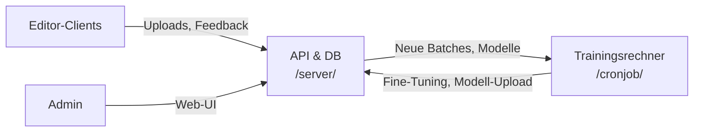

# Signz-Mind v0.5.0

**KI-gestütztes Editor- und Trainingssystem mit modularer Architektur.**

---

## Übersicht

**Signz-Mind** ist eine offene Plattform zur Sammlung, Korrektur, Verwaltung und KI-gestützten Verbesserung von Programmcode.  
Das System besteht aus zwei Hauptkomponenten:
- **Server** (`/server/`): API, Usermanagement, Daten- und Modellverwaltung, Admin-Web-UI
- **Tower** (`/cronjob/`): Automatisierter Trainingsrechner/Cronjob für Fine-Tuning und Modellmanagement

Die Plattform ermöglicht es, anonymisierte Nutzungsdaten und Codebeispiele zu erfassen, eigene ML-Modelle für Korrekturvorschläge zu trainieren und die Zusammenarbeit mehrerer Clients und Admins sicher zu steuern.

---

## Features

- **Benutzer- und Rollenverwaltung (Server, Admin-UI)**
- **API für Daten- und Modell-Uploads**
- **Sicheres Authentifizierungssystem (JWT, API-Key)**
- **Automatisiertes Training & Deployment von KI-Modellen (Tower)**
- **Workflow-Orchestrierung für tägliches Fine-Tuning**
- **Robustes Logging, Fehler- und Ressourcenmanagement**
- **Modularer Aufbau – leicht erweiterbar**

---

## Architektur



---

## Schnellstart

1. **Klonen** des Repositories
2. **Server einrichten**  
   Siehe [Server-README](/server/README.md)
3. **Tower (Cronjob) einrichten**  
   Siehe [Cronjob-README](/cronjob/README.md)
4. **Admin-User anlegen, API-Keys generieren**
5. **(Optional) Editor-Client anbinden**

---

## Verzeichnisstruktur

```
/server/         # Backend, Admin-UI, API, Usermanagement
/cronjob/        # Tower-Workflow, Training, Modell-Upload
/Klassen/        # Gemeinsame Kernmodule (Code-Korrektur, Data-Manager etc.)
/data/           # (wird zur Laufzeit angelegt: Uploads, Modelle)
/README.md       # Diese Datei
```

---

## Support & Weiterentwicklung

- Featurewünsche & Bugs bitte als Issue einstellen.
- Kollaborationen willkommen!

---

## Lizenz

**MIT License** (siehe LICENSE-Datei)

---

## Project Summary in English

**Signz-Mind** is an open-source, modular platform for collecting, correcting, and improving code with AI assistance.  
It consists of a FastAPI-based server (with user management, API endpoints, and an admin web UI) and an automated "Tower" training node for fine-tuning and deploying machine learning models.  
Signz-Mind enables organizations or teams to collect anonymized code, continuously improve custom AI models, and manage contributors securely.  
The project is extensible, supports role-based access control, and is designed for professional, collaborative use.

---
